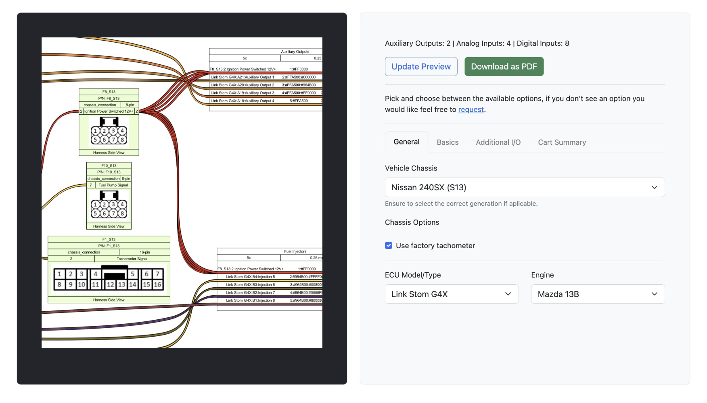

# ecu-viz

Effortlessly craft engine wiring diagrams for your project using. Save time planning with a user-friendly interface and clear, easy-to-understand visuals. Spend seconds, not hours, bringing your project to life.

### Features
- Support for both gasoline rotary and piston engines.
- Extensive compatibility with a wide selection of popular ECUs.
- High-resolution, easy-to-follow wiring diagrams with detailed annotations.
- Flexible injector operation modes, including Sequential, Semi-Sequential, and Batch.
- Multiple ignition modes supported, such as Direct Fire and Wasted Spark.
- Comprehensive chassis integration wiring for numerous popular vehicles, retaining OEM functionality.
- Support for idle stepper valves with 3- to 6-wire systems.
- Flex fuel compatibility for seamless ethanol and gasoline blending.
- Drive-by-wire functionality for supported ECUs.
- CAN bus integration for peripherals like lambda controllers, gauges, and more.
- Detailed I/O breakdown with a descriptive pinout sheet for clarity.
- Comprehensive sourcing and pricing information for connectors.

[Live Example](http://viz.petersoboyejo.com/)



### Supported Vehicles
- [Mazda RX-7 (Series 4)](https://github.com/dzt/ecu-viz/tree/main/pinout_data/chassis/fc_s4)
- [Mazda RX-7 (Series 5)](https://github.com/dzt/ecu-viz/tree/main/pinout_data/chassis/fc_s5)
- [Mazda RX-7 (Series 6 - M/T Chassis)](https://github.com/dzt/ecu-viz/tree/main/pinout_data/chassis/fd_s6)
- [Mazda RX-8 (S1)](https://github.com/dzt/ecu-viz/tree/main/pinout_data/chassis/rx8_s1)
- [Nissan 240SX (S13)](https://github.com/dzt/ecu-viz/tree/main/pinout_data/chassis/s13)
- [Nissan 240SX (S14 OBDII)](https://github.com/dzt/ecu-viz/tree/main/pinout_data/chassis/s14)
- [Lexus IS300 (2002+)](https://github.com/dzt/ecu-viz/tree/main/pinout_data/chassis/is300_2002+)
- [BMW 3-Series (1984-1986 / Early Model)](https://github.com/dzt/ecu-viz/tree/main/pinout_data/chassis/e30)
- [BMW 3-Series (1995-1999 / OBD2)](https://github.com/dzt/ecu-viz/tree/main/pinout_data/chassis/e36)
- [BMW 3-Series (1987+ / Late Model)](https://github.com/dzt/ecu-viz/tree/main/pinout_data/chassis/e36)
- [Toyota Chaser/Cresta/MKII (JZX100, 1996-1998)](https://github.com/dzt/ecu-viz/tree/main/pinout_data/chassis/jzx100)
- [Toyota Chaser/Cresta/MKII (GX100, 1996-1998)](https://github.com/dzt/ecu-viz/tree/main/pinout_data/chassis/gx100)


### Installation

ecu-viz requires the following
- [Node.js (LTS Version)](http://nodejs.org/)
- [Python 3.7 or later](https://www.python.org/downloads/)
- [WireViz](https://github.com/wireviz/WireViz)

Setup:

```sh
git clone https://github.com/dzt/ecu-viz.git
cd ecu-viz
npm install
```

Run After Setup:

```sh
npm run server
```

Remote Server Instructions
```sh
# Install required packages
curl -sL https://deb.nodesource.com/setup_14.x -o nodesource_setup.sh
sudo bash nodesource_setup.sh
sudo apt install nodejs npm build-essential python3 python3-pip graphviz nginx -y
pip3 install wireviz --break-system-packages
sudo npm install pm2@latest -g

# Enable Firewall
ufw enable
ufw allow ssh
ufw allow http
ufw allow https
ufw allow 'Nginx HTTP'
ufw allow 'Nginx Full'
ufw status # If it is disabled, run the ufw enable command

# Clone Repo
git clone https://github.com/dzt/ecu-viz.git
cd ecu-viz
sudo npm install

# Configure Reverse Proxy via Nginx
sudo vim /etc/nginx/sites-available/default
sudo nginx -t
sudo systemctl restart nginx

# Setup PM2 to run automatically whenever the server restarts
pm2 startup systemd
pm2 start pm2.json
pm2 save
```

Basic Nginx Config
```
location / {
    proxy_pass http://127.0.0.1:8080;
    proxy_http_version 1.1;
    proxy_set_header Upgrade $http_upgrade;
    proxy_set_header Connection 'upgrade';
    proxy_set_header Host $host;
    proxy_cache_bypass $http_upgrade;
}
```

## License

```
The MIT License (MIT)

Copyright (c) 2024 Peter Soboyejo <http://petersoboyejo.com/>

Permission is hereby granted, free of charge, to any person obtaining a copy of this software and associated documentation files (the "Software"), to deal in the Software without restriction, including without limitation the rights to use, copy, modify, merge, publish, distribute, sublicense, and/or sell copies of the Software, and to permit persons to whom the Software is furnished to do so, subject to the following conditions:

The above copyright notice and this permission notice shall be included in all copies or substantial portions of the Software.

THE SOFTWARE IS PROVIDED "AS IS", WITHOUT WARRANTY OF ANY KIND, EXPRESS OR IMPLIED, INCLUDING BUT NOT LIMITED TO THE WARRANTIES OF MERCHANTABILITY, FITNESS FOR A PARTICULAR PURPOSE AND NONINFRINGEMENT. IN NO EVENT SHALL THE AUTHORS OR COPYRIGHT HOLDERS BE LIABLE FOR ANY CLAIM, DAMAGES OR OTHER LIABILITY, WHETHER IN AN ACTION OF CONTRACT, TORT OR OTHERWISE, ARISING FROM, OUT OF OR IN CONNECTION WITH THE SOFTWARE OR THE USE OR OTHER DEALINGS IN THE SOFTWARE.
```