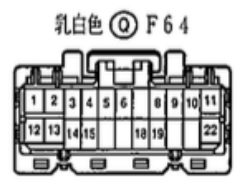
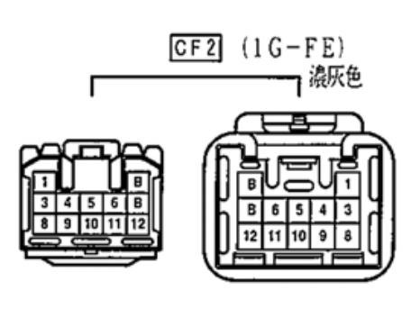
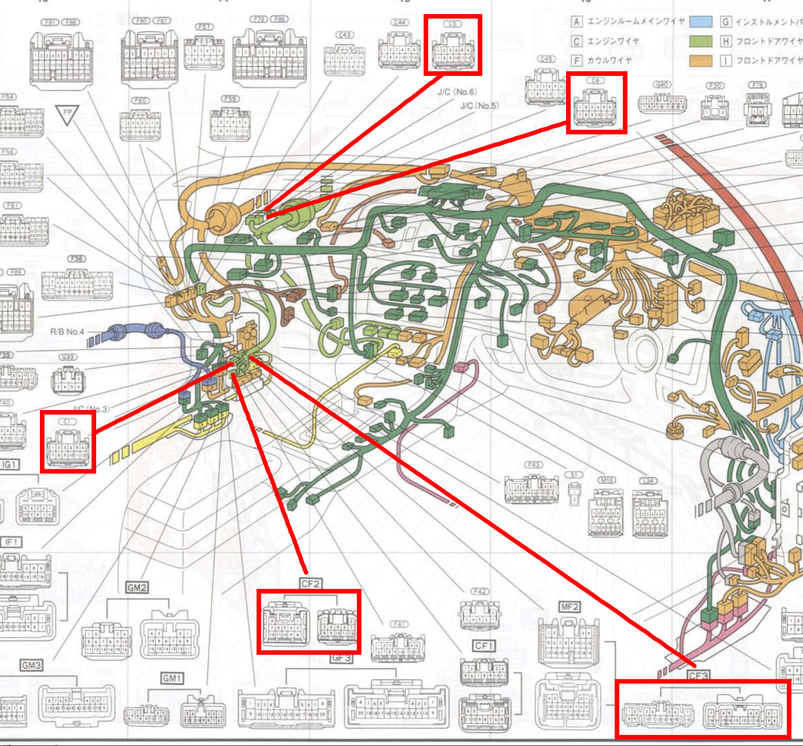
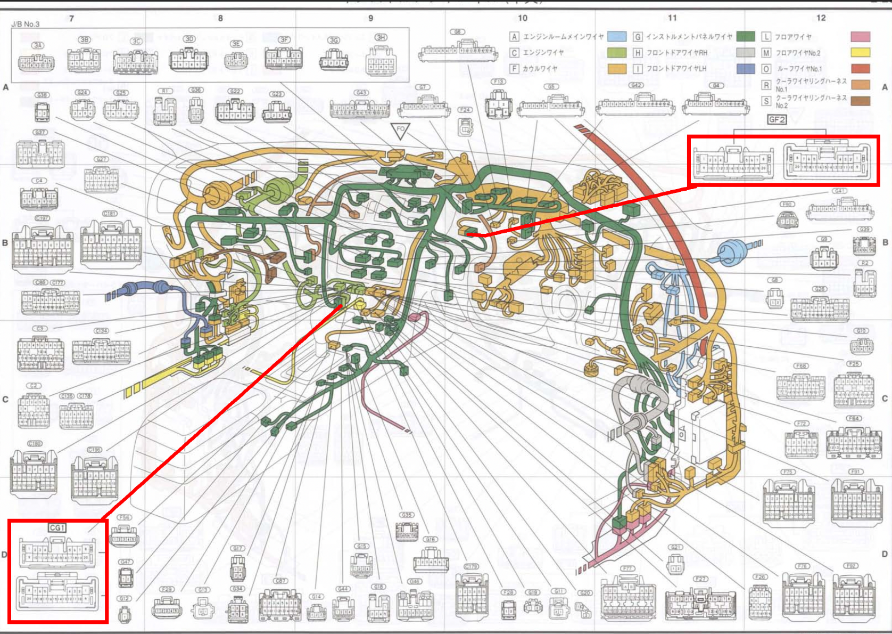

# Toyota Chaser/Cresta/MKII (GX100)

On the Toyota JZX100 and GX100, there are connectors originally coming off of the engine harness that mate to the body harness, alongisde with connector(s) from the OEM body harness that mate to the factory ECU. These cars in particular have a CAN-bus like protocol known as [Bean Multiplex](http://wilbo666.pbworks.com/w/file/fetch/93419378/SAE970297%20Toyota%20Body%20Electronics%20Area%20Network%20(BEAN).pdf), where very few ECUs are able to control such. Luckily, LinkECU has developed hardware in their AltezzaPNP and JZX100 PNP units that contain a pin known as "BEAN" or "THWO", enabling users to have working Air Conditioning and CLT reading on the factory instrument cluster. This document will go over the entire factory 1G-FE (non-VVTi) engine harness up to August '98. The documentation written was used to develop GX100/JZX100 implementation into ecu-viz.

## Default Connectors

`GX_100_F64`
- Part Number: Unknown / NLA
- Note(s): White in Color. Connection Point originally mating to the factory ECU by the center console. Male connector is not available or an option if you choose to create a full custom engine hanress. One can take the factory header and pot it if you intend on making a connector to communicate with the connector. Otherwise, repin the connector to a universal connector of your choice to communicate with your engine harness.

    

    | Pin | Description / Function | ECUViz Type    |
    |-----|------------------------|----------------|
    | 1   | STA                    | `null`         |
    | 2   | AC1                    | `null`         |
    | 3   | SPD                    | `null`         |
    | 4   | ACMG                   | `null`         |
    | 5   | OD2/PWRL               | `null`         |
    | 6   | ELS                    | `null`         |
    | 7   | W                      | `null`         |
    | 8   | MREL                   | `null`         |
    | 9   | EGW                    | `null`         |
    | 10  | IGSW                   | `switched_12v` |
    | 11  | BATT                   | `null`         |
    | 12  | NSW                    | `null`         |
    | 13  | P                      | `null`         |
    | 14  | IND                    | `null`         |
    | 15  | ELS3                   | `null`         |
    | 16  | ELS2                   | `null`         |
    | 17  | MSW                    | `null`         |
    | 18  | RSPD                   | `null`         |
    | 19  | STP                    | `null`         |
    | 20  | FC                     | `fuel_pump`    |
    | 21  | AC2                    | `null`         |
    | 22  | +B                     | `null`         |

`GX_JZX_100_CG1`
- Part Number: Unknown / NLA
- Note(s): White Connector located near the ECU by the center console.

    

    | Pin | Description / Function                         | ECUViz Type |
    |-----|------------------------------------------------|-------------|
    | 1   | Water Temp Sender Ground to Instrument Cluster | `null`      |
    | 2   | Not Used                                       | `null`      |
    | 3   | Air Conditioning Computer (SG Pin)             | `null`      |
    | 4   | Air Conditioning Computer (Mag-Clutch Switch)  | `null`      |
    | 5   | Fuel Filter Switch to Instrument Cluster       | `null`      |
    | 6   | Instrument Cluster Speedo (M/T Chassis)        | `null`      |
    | 7   | Instrument Cluster Speedo (M/T Chassis)        | `null`      |
    | 8   | ECU Communication (C3, Pin 10, #10)            | `null`      |
    | 9   | Reverse Light to Instrument Cluster (A/T)      | `null`      |
    | 10  | Low Gear Light to Instrument Cluster           | `null`      |
    | 11  | 2nd Gear Light to Instrument Cluster (A/T)     | `null`      |
    | 12  | Drive Light to Instrument Cluster (A/T)        | `null`      |
    | 13  | Neutral Light to Instrument Cluster (A/T)      | `null`      |
    | 14  | Park Light to Instrument Cluster (A/T)         | `null`      |
    | 15  | Ground Light to Instrument Cluster (A/T)       | `null`      |
    | 16  | Not Used Light to Instrument Cluster (A/T)     | `null`      |
    | 17  | Tachometer Signal to Instrument Cluster        | `tacho`     |
    | 18  | Oil Pressure Switch to Instrument Cluster      | `null`      |
    | 19  | Water Temp Sender Signal to Instrument Cluster | `null`      |
    | 20  | Not Used                                       | `null`      |

`GX_JZX_100_C1`
- Part Number: Toyota 90980-11661
- Note(s): White in Color. All pins 12 function the same, and are responsible for originally providing Switched 12V+ to Injectors and Ignition coils on the 1G-FE engine.

    

    | Pin | Description / Function                             | ECUViz Type    |
    | --- | -------------------------------------------------- | -------------- |
    | 1   | Switched 12V+ via Ignition Switch to Injector      | `switched_12v` |
    | 2   | Switched 12V+ via Ignition Switch to Injector      | `switched_12v` |
    | 3   | Switched 12V+ via Ignition Switch to Injector      | `switched_12v` |
    | 4   | Switched 12V+ via Ignition Switch to Injector      | `switched_12v` |
    | 5   | Switched 12V+ via Ignition Switch to Injector      | `switched_12v` |
    | 6   | Switched 12V+ via Ignition Switch to Injector      | `switched_12v` |
    | 7   | Switched 12V+ via Ignition Switch to Ignition Coil | `switched_12v` |
    | 8   | Switched 12V+ via Ignition Switch to Ignition Coil | `switched_12v` |
    | 9   | Switched 12V+ via Ignition Switch to Ignition Coil | `switched_12v` |
    | 10  | Switched 12V+ via Ignition Switch to Ignition Coil | `switched_12v` |
    | 11  | Switched 12V+ via Ignition Switch to Ignition Coil | `switched_12v` |
    | 12  | Switched 12V+ via Ignition Switch to Ignition Coil | `switched_12v` |

## Additional Connectors

`GX_100_CF2`
- Part Number: Unknown / NLA
- Note(s): TODO

    

    | Pin | Description / Function                             | ECUViz Type    |
    | --- | -------------------------------------------------- | -------------- |
    | 1   | Switched 12V+ via Ignition Switch to Injector      | `null`         |
    | 2   | Switched 12V+ via Ignition Switch to Injector      | `null`         |
    | 3   | Switched 12V+ via Ignition Switch to Injector      | `null`         |
    | 4   | Switched 12V+ via Ignition Switch to Injector      | `null`         |
    | 5   | Switched 12V+ via Ignition Switch to Injector      | `null`         |
    | 6   | Switched 12V+ via Ignition Switch to Injector      | `null`         |
    | 7   | Switched 12V+ via Ignition Switch to Ignition Coil | `null`         |
    | 8   | Switched 12V+ via Ignition Switch to Ignition Coil | `null`         |
    | 9   | Switched 12V+ via Ignition Switch to Ignition Coil | `null`         |
    | 10  | Switched 12V+ via Ignition Switch to Ignition Coil | `null`         |
    | 11  | Switched 12V+ via Ignition Switch to Ignition Coil | `null`         |
    | 12  | Switched 12V+ via Ignition Switch to Ignition Coil | `null`         |

`GX_100_CF3`
- Part Number: Unknown / NLA
- Note(s): TODO

    

## Connector Locations

